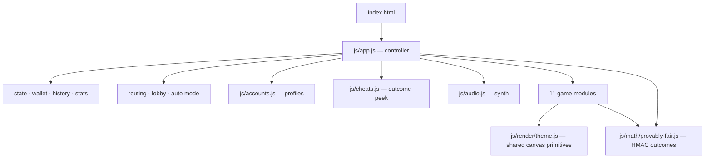

# Nour's Casino

**Eleven provably-fair casino Originals. Zero dependencies, zero build step, zero backend.**

A standalone play-money casino suite — Plinko, Crash, Twist, Limbo, Roulette, Pocket Dice,
Dice, Hilo, Keno, Mines and Blackjack — written in plain ES modules and Canvas 2D. The site
has no bundler, no framework, no runtime dependency, no CDN-hosted JS or CSS, and not a single
image, sprite or audio file: every pixel on every stage is drawn procedurally and every sound
is synthesised. The one external request the app makes is the Google Fonts stylesheet for
Inter + Roboto Mono; delete those three `<link>` tags in `index.html` and it falls back to the
system stack and runs fully offline.

`package.json` exists only for the Cloudflare deploy toolchain — `wrangler` is the sole
devDependency and nothing it installs is ever shipped to the browser. Skip `npm install`
entirely and the site still runs.

**▶ Play it: [nou4r.github.io/nours-casino](https://nou4r.github.io/nours-casino/)**

Serve the folder over HTTP and it runs.

```bash
python -m http.server 8080
# → http://localhost:8080/index.html
```

Windows users can just double-click `start.bat`.

> **Play money only.** The wallet starts at a fictional `$1000`, lives in `localStorage`, and
> can be reset or edited at will. Nothing is wagered, deposited, transmitted or persisted
> anywhere off your machine.

---

## Contents

- [Why it exists](#why-it-exists)
- [The games](#the-games)
- [Features](#features)
- [Provably fair](#provably-fair)
- [Architecture](#architecture)
- [Project layout](#project-layout)
- [The money invariant](#the-money-invariant)
- [Shared canvas theme](#shared-canvas-theme)
- [Development](#development)
- [Deploy to Cloudflare](#deploy-to-cloudflare)
- [Adding a twelfth game](#adding-a-twelfth-game)
- [Browser support & accessibility](#browser-support--accessibility)
- [Disclaimer](#disclaimer)

---

## Why it exists

Casino Originals are a great excuse to write a lot of interesting code in a small space:
HMAC-derived randomness, a soft-body-ish physics sim, eleven bespoke canvas renderers sharing
one design language, a Web Audio synthesiser with no audio files, and a money path that must
never lose a cent no matter how the UI is abused.

The visual language is modelled on [Gamdom's](https://gamdom.com) Originals, but every line of
code, every payout table and every piece of art here is original and self-contained. Nothing is
fetched at runtime beyond the two web fonts.

---

## The games

| Game | Mechanic | Notes |
|---|---|---|
| **Plinko** | Ball drops through a peg pyramid into a multiplier bucket | 8–16 rows × low/medium/high risk, up to 60 balls in flight, real physics sim |
| **Crash** | Multiplier curve rises until it busts; cash out first | `1.06 ^ (4t)` curve, crash point `max(1, 99 / float)` (~99% RTP), glowing orb head, other-player cashout markers |
| **Twist** | Three celestial rings (Planet / Moon / Sun) orbit toward a bust threshold | Mid-round cashout |
| **Limbo** | Pick a target multiplier, roll against it | Instant, DOM readout + canvas rail |
| **Roulette** | 15-slot horizontal strip spinner | ~4s spin, abortable |
| **Pocket Dice** | Roll over/under a slider threshold | Shares the dice engine |
| **Dice** | Classic over/under with adjustable win chance | Shares the dice engine |
| **Hilo** | Guess higher or lower on the next card | Progressive multiplier, mid-round cashout |
| **Keno** | Pick up to 10 of 40 tiles, payout by match count | |
| **Mines** | 5×5 grid, 1–20 mines, reveal-and-bank | Mid-round cashout |
| **Blackjack** | Classic 21 vs dealer | Hit / stand / double |

All eleven are reachable from the lobby, the tab strip, or a hash route (`#/crash`).

---

## Features

**Lobby & routing.** The app opens on a lobby with eleven animated cards (inline SVG,
CSS-animated), tag filters, live search, and hero stats that reflect your current session.
`#/` is the lobby, `#/<game>` is a game — browser Back/Forward work correctly, and navigating
away from a live round never tears it down or strands your stake.

**Provably fair, verifiable in-page.** Every outcome is HMAC-SHA256 over
`(serverSeed, clientSeed, nonce)`. The server-seed hash is shown up front, the seed is revealed
on rotation, and a built-in verifier re-derives any past round. See [below](#provably-fair).

**Cheat mode.** Because nothing is hidden on a server, the next round is derivable *before* you
bet. Press `C` and a HUD shows the upcoming (or in-flight) outcome for whichever game you are
on — the exact bucket, crash point, mine positions, dealer hole card, all ten keno numbers.
It is a live demonstration of what "provably fair" actually means. Each peek calls the game's
own exported calculator, never a second copy of the derivation.

**Player profiles.** Named save slots in `localStorage`, each with its own wallet, seeds,
nonce, history and stats. Optional PINs (a shared-computer courtesy, *not* security — SHA-256,
unsalted, verified in the browser, and the UI says so). Sessions export to a single-line
`NOURSCASINO01.…` code that survives a paste into any chat box, and import back.

**Customization.** Set an exact balance, a house edge (negative is allowed — you can make the
house lose), bet limits, and a max-win cap. Payouts scale from the 1% baseline edge every table
was built at, so the default is byte-identical to untouched behaviour.

**Auto mode.** Run 1–∞ rounds unattended. Games with a mid-round decision report `busy` so the
loop waits instead of double-betting; it stops automatically when the balance can't cover the
next bet.

**Synthesised audio.** `js/audio.js` is a small Web Audio synthesiser. Every peg tick, win
chime, bust and card flip is generated — the project ships no audio files.

**Hotkeys** (game route only, so a focused lobby card can never place a bet):

| Key | Action |
|---|---|
| `Space` | Primary action (drop / bet / deal) |
| `A` / `S` / `D` | Half bet / double bet / max bet |
| `C` | Toggle cheat mode |
| `M` | Mute |
| `Esc` | Close modal |

**Reduced motion.** `prefers-reduced-motion: reduce` collapses the lobby to a fully static
state and switches every canvas stage to its static draw path. Canvas can't hear CSS, so each
game reads the media query directly and subscribes to its `change` event.

**Built for a phone, not shrunk onto one.** On a 390×844 phone the game board gets **75% of
the screen**. The header collapses to one 64px row — the seven tools live in a bottom sheet
behind a single button — the results rail and every keyboard hint disappear, and the bet
action becomes a fixed, thumb-reachable bar. The balance stays pinned in the header where a
casino should keep it, and the lobby becomes the game switcher.

Every one of the eleven stages then re-solves its own layout for the tall, narrow box rather
than scaling a desktop design down. Mines and keno re-pick their grid shape and fill the
width; hilo and blackjack grow and re-fan their cards; plinko's pyramid stretches into the
height with upright, fully-spelled multiplier chips. The three horizontal-core games refuse
to distort: crash, roulette and limbo cap their curve/strip/rail and spend the surplus on a
giant readout and an in-canvas results history instead. Canvas tap targets are ≥48px, chrome
targets ≥44px, `env(safe-area-inset-*)` is respected on notched devices, modals open as
bottom sheets, and a pull-down mid-round can't reload the page. Verified across 11 viewports
from 320×568 to 1920×1080, portrait and landscape.

---

## Provably fair

```
outcome = HMAC-SHA256(serverSeed, `${clientSeed}:${nonce}`)
        → hex → float(s) in [0,1) → game-specific mapping
```

Every game derives from that one primitive (`js/math/provably-fair.js`), so a single verifier
covers all eleven. Web Crypto is used when available; a bundled SHA-256 implementation is the
fallback, and `usesWebCrypto` reports which path is live.

How to verify a round:

1. Before playing, note the **server seed hash** shown in the Fairness modal.
2. Play. The **nonce** increments once per round; your **client seed** is editable at any time.
3. Rotate the server seed. The previous seed is now revealed.
4. Paste seed + client seed + nonce into the verifier — it re-derives the outcome and compares.

`sha256(revealedServerSeed)` must equal the hash you were shown in step 1. That is what makes
the commitment binding: the outcome was fixed before you bet, and the app could not have
changed it afterwards.

Public API:

```js
import {
  createSeedPair, generateOutcome, verifyOutcome,
  hmacSha256Hex, sha256Hex, randomSeed, usesWebCrypto
} from './js/math/provably-fair.js';
```

---

## Architecture



`index.html` loads exactly one script — `js/app.js` — and everything else is reached through
imports.

### Ownership boundaries

| Concern | Owner | Never touched by |
|---|---|---|
| Balance, bet, nonce, stats, history | `js/app.js` (`state`) | game modules |
| Wallet debit / credit | `js/app.js` handlers only | game modules |
| Canvas rendering, per-game animation | the game module | `app.js` |
| Seeds, HMAC, outcome derivation | `js/math/provably-fair.js` | everyone else reuses it |
| Sound | `js/audio.js` singleton, injected | game modules never construct one |

**Game modules never touch money.** They compute an outcome and hand it back; `app.js` debits
before the round and credits on settle. That single rule is why the balance invariant holds.

### The module contract

```js
export class SomeGame {
  constructor(elementOrSelectorOrOptions, { audio, betAmount, onX } = {}) {}
  setBet(amount) {}
  async play(serverSeed, clientSeed, nonce) {}   // → outcome
  cashout() {}                                   // mid-round games only
  reset() {}
  resize() {}
  getState() {}
}

// plus a pure, side-effect-free calculator the class itself calls:
export async function calculateSomeGameOutcome(serverSeed, clientSeed, nonce) {}
```

All eleven are instantiated in `init()` inside individual `try/catch` blocks — one game failing
to construct must never take the page down.

### Debug handle

`window.plinko` exposes `{ state, pending, physics, <all 11 game instances>, audio, auto,
selectGame, enterGame, showLobby, applyLobbyFilter, …handlers }`. Everything the UI can do can
be driven from the console.

---

## Project layout

```
index.html              Markup: topbar, lobby + 11 inline SVG card scenes, control panes, stages, modals
styles.css              Base theme, layout grid, components, responsive
css/gamdom.css          Colour tokens, live-bets skin, chrome polish, cheat panel   (loaded 2nd)
css/lobby.css           Lobby design system: routes, hero, grid, card-art keyframes (loaded last)
start.bat               Windows launcher (python http.server + opens browser)

js/app.js               Controller: state, wallet, history, stats, auto mode, routing, all wiring
js/accounts.js          Named profiles in localStorage + export/import codes
js/cheats.js            Outcome peek for all 11 games (pure — never mutates anything)
js/physics.js           Plinko board: peg pyramid, ball sim, bucket VFX
js/audio.js             Web Audio synthesiser — zero audio files
js/render/theme.js      Shared canvas primitives: palette, paintStage, peg/chip/tile/card/…
js/math/provably-fair.js  HMAC-SHA256 outcomes, seed pair, verifier, SHA-256 fallback
js/math/multipliers.js  Plinko payout tables (8–16 rows × 3 risks) + binomial/RTP math

js/games/{crash,twist,limbo,roulette,dice,hilo,keno,mines,blackjack}.js

wrangler.jsonc          Cloudflare assets-only Worker config (no `main`, no Worker code)
.assetsignore           ALLOW-LIST of what Cloudflare may publish — read before adding a root file
_headers                Edge security + cache headers (parsed by Cloudflare, never served)
package.json            Deploy toolchain only; `wrangler` is the sole devDependency
tools/check-syntax.mjs  Cross-platform `node --check` gate (`npm run check`)
```

~23k lines total. `dice.js` backs both the **Dice** and **Pocket Dice** tabs.

---

## The money invariant

The one assertion that must hold after any sequence of actions:

```js
balance === START_BALANCE + stats.adjusted - stats.wagered + stats.returned
```

Three rules keep it true, and each exists because breaking it shipped a real bug once:

1. **Any promise a stake awaits must be settleable.** `app.js` debits before the round and
   credits in the `await` continuation, so a promise that is neither resolved nor rejected
   silently eats the player's money — no error, no trace. Every round promise therefore has an
   abort path (cancellation rejects it, `app.js` refunds) and a `try/catch` inside its rAF body,
   because a throw in a rAF callback never rejects the enclosing promise.
2. **Only rendering may be skipped when hidden.** The render loop re-arms `requestAnimationFrame`
   *first, unconditionally*, then advances round state, and only then decides whether to paint.
   Gating state behind `document.hidden` freezes a round in a background tab and strands the stake.
3. **Bank after you settle, never before.** Switching profiles settles pending rounds first, then
   snapshots the outgoing wallet. The reverse order throws the refund away. A profile switch during
   a live non-Plinko round is refused outright, because that stake lives inside an awaited promise
   and would credit whichever wallet is loaded later.

Refunds and deposits deliberately bypass the house-edge scaler — scaling a refund at a negative
edge would mint money out of a cancelled round.

---

## Shared canvas theme

Every stage renders through `js/render/theme.js` so eleven games read as one product. Check for
an existing primitive before writing bespoke canvas code:

```js
import * as T from '../render/theme.js';

T.PALETTE / T.HEAT / T.heatColor(mult, maxMult)
T.roundRect(ctx, x, y, w, h, r)            // traces path only — you fill/stroke
T.alpha(hex, a)
T.createStarfield(count, seed)             // ONCE per instance, never per frame
T.paintStage(ctx, w, h, { stars, glow, glowX, glowY, glowStrength, vignette })
T.glowOrb(ctx, x, y, r, color, { halo, core })
T.peg(ctx, x, y, r, flash, flashColor)
T.chip(ctx, x, y, w, h, { color, label, radius, lift, font })     // top-left origin
T.tile(ctx, x, y, w, h, { state, accent, radius })                // idle|hover|selected|revealed|bad
T.card(ctx, x, y, w, h, { rank, suit, faceUp, glow, glowColor })
T.heroText / T.caption / T.panel
```

All coordinates are CSS pixels; callers own DPR (`ctx.scale(dpr, dpr)` once on resize). Every
helper is `save()`/`restore()` balanced, so no call leaks `shadowBlur` or `fillStyle`.

Palette: mint `#00ff86` (primary/win), red `#ef4444` (loss), gold `#fbbf24` (jackpot tier),
base `#070b12` → `#0d1420`. Each stage adds one accent glow for its own identity.

---

## Development

There is no toolchain to install. Edit a file, reload the page.

The only automated gate is a syntax check, which runs on any platform:

```bash
npm run check          # → "OK  17 modules parsed cleanly."
```

It also runs automatically as `predeploy`, so a module that won't parse can't reach the edge.
Without Node tooling the equivalent POSIX one-liner is:

```bash
for f in js/*.js js/games/*.js js/math/*.js js/render/*.js; do node --check "$f" || echo "FAIL $f"; done
```

`node --check` catches parse errors only — it will happily accept a duplicate `const` in
different branches or an orphaned method body that throws at import time. **When a page goes
blank, read the browser console before trusting the syntax loop**, and confirm `window.plinko`
exists after a reload.

`AGENTS.md` is the full engineering handoff: subsystem-by-subsystem design notes, the render-loop
contract, the money-path traps, and a log of what has actually been verified (and what hasn't).
Read it before making a non-trivial change.

Not present: automated regression tests, cross-browser CI, per-game RTP convergence runs over
large samples.

---

## Deploy to Cloudflare

The site deploys as an **assets-only Worker** — `wrangler.jsonc` has no `main`, so no Worker
code exists and no Worker code runs. Cloudflare serves the files straight from the edge.

```bash
npm install            # one-time; installs wrangler as the only devDependency
npm run login          # opens a browser, authorises YOUR Cloudflare account
npm run deploy         # → https://nours-casino.<your-subdomain>.workers.dev
```

That is the whole flow. Rename the Worker by changing `name` in `wrangler.jsonc`. To preview
the exact upload without touching your account, run `npm run deploy:dry`.

### `.assetsignore` is the only thing keeping private files off the edge

The assets directory is the repo root, because that is also what GitHub Pages serves. **Wrangler
does not read `.gitignore`** — it uploads every file it finds. So `.assetsignore` is written as
an *allow-list*: ignore everything at the root, then re-admit `index.html`, `styles.css`, `css/`
and `js/`.

That direction is deliberate. An allow-list fails loudly (a missing file 404s); a deny-list fails
silently (a new `secrets.txt` in the root gets published). `cookies.txt`, `.git/`, `node_modules/`,
`package.json`, `AGENTS.md` and `tools/` are all verified absent from the served output.

**Read `.assetsignore` before adding a file to the project root.**

### Headers

`_headers` is parsed by Cloudflare and applied at the edge; it is excluded from the allow-list so
it is never downloadable. It sets `nosniff`, `X-Frame-Options: DENY`, a `Referrer-Policy`, a
`Permissions-Policy`, and a CSP tight enough to be meaningful:

```
default-src 'self'; script-src 'self'; connect-src 'self'; object-src 'none';
frame-ancestors 'none'; form-action 'none'; base-uri 'self';
style-src 'self' 'unsafe-inline' https://fonts.googleapis.com;
font-src  'self' https://fonts.gstatic.com;
img-src   'self' data:;
```

Only two allowances are load-bearing: `'unsafe-inline'` in `style-src` (29 inline
`style="--accent:…"` attributes in `index.html`) and `data:` in `img-src` (the favicon is an
inline SVG data URI). There are no inline `<script>` blocks and no inline event handlers, so
`script-src 'self'` holds with nothing loosened. Verified: the app boots and plays a full round
under this CSP with zero violations.

### `npm run dev` needs `--persist-to` outside the tree

`wrangler dev` watches its assets directory, which here is the repo root — and it writes its own
local state into `.wrangler/` *inside* that directory. Left alone it detects its own writes and
reload-loops forever, several times a second. The `dev` script therefore parks that state in a
sibling folder:

```bash
wrangler dev --persist-to ../.nours-casino-wrangler-state
```

For plain frontend work you do not need any of this — `npm run serve` (or `start.bat`) is faster
and has no such trap. Reach for `wrangler dev` only to test `_headers`, the CSP, or 404 behaviour.

### GitHub Pages still works

Pages and Cloudflare are independent and can both be live: Pages serves the repo root from the
`main` branch (`.nojekyll` keeps it verbatim), Cloudflare serves the `.assetsignore` subset.
Neither knows about the other.

One asymmetry worth knowing: **GitHub Pages has no `_headers` support**, so the CSP and the
security headers above apply to the Cloudflare deployment only. The Pages demo linked at the top
of this README runs with GitHub's default headers.

---

## Adding a twelfth game

1. `js/games/<name>.js` — a class following the [module contract](#the-module-contract), plus a
   pure `calculate<Name>Outcome(...)` going through `hmacSha256Hex`. **The class must call that
   exported function** rather than deriving inline, or the cheat peek and the real round drift apart.
2. `index.html` — a `.game-tab`, a `#view-<name>` stage, a `#pane-ctrl-<name>` sidebar pane, and a
   `.game-card` in `#lobby-grid` with its own inline SVG scene (unique gradient ids).
3. `js/app.js` — import, instantiate in `init()` inside its own `try/catch`, add `play<Name>()`,
   wire into `primaryAction()` / `autoTick()`, add the key to `GAMES` and the label/instance lookups,
   export on `window.plinko`. Two silent-if-missed obligations: **wrap the await in `trackRound()`**
   so the profile guard can see the stake, and **credit through `effectivePayout()`** so the house
   edge and max-win cap apply.
4. `js/cheats.js` — a `PEEKS['<name>']` entry returning the panel model.
5. Style in `styles.css`; card keyframes in `css/lobby.css`.
6. Verify: syntax loop, then drive it from `window.plinko` and confirm the money invariant still holds.

---

## Browser support & accessibility

Modern evergreen browsers (ES modules, Canvas 2D, Web Audio, Web Crypto). Web Crypto is optional
— a bundled SHA-256 fallback covers non-secure contexts.

Keyboard-navigable throughout, ARIA labels on controls, focus trapping in modals, and full
`prefers-reduced-motion` support (51 running animations become 0). Responsive from 320px up,
with 44px touch targets and safe-area insets on `pointer: coarse` devices.

---

## Disclaimer

Play money. No real currency, no accounts, no payments, no backend, no analytics, no telemetry.
Everything lives in your browser's `localStorage`, and the only request the app makes is for the
Google Fonts stylesheet (removable — see the top of this README).

Not affiliated with, endorsed by, or derived from the code of Gamdom or any other operator. The
visual language is an homage; the implementation is original.

If real gambling is a problem for you or someone you know, help is available —
[BeGambleAware](https://www.begambleaware.org/) · [Gamblers Anonymous](https://www.gamblersanonymous.org/).
